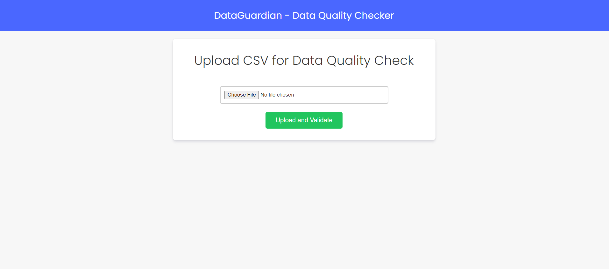
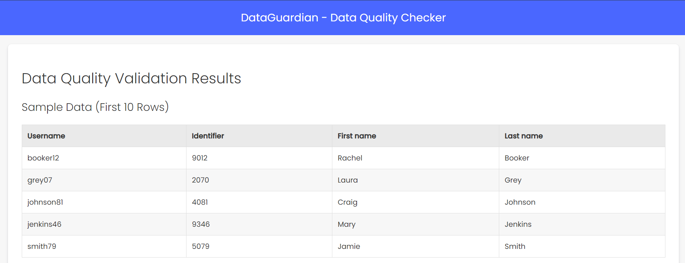
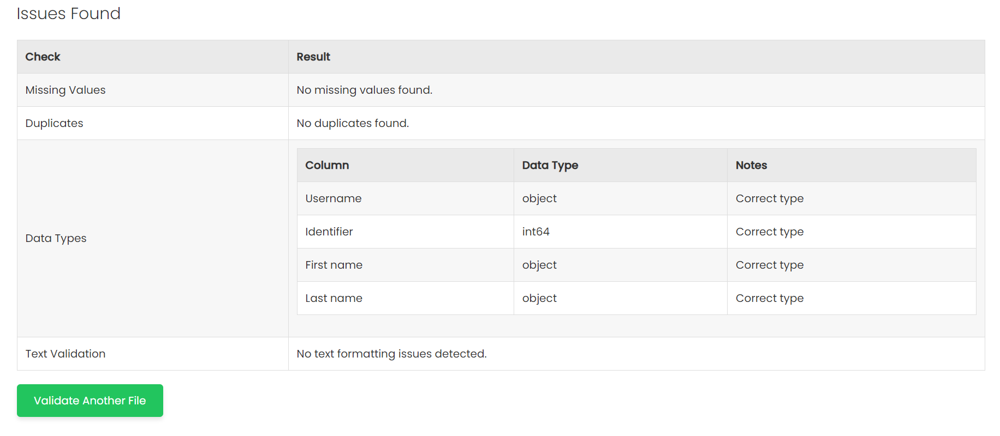

#  DataGuardian - Data Quality Checker Web App

This project is a web application developed using Flask, designed to upload CSV files and perform various data quality checks. The application provides an interface where users can upload their data and get immediate feedback on issues like missing values, duplicates, text formatting issues, and data type inconsistencies.

## Features

- Upload CSV files via a web form.
- Perform comprehensive data quality checks:
  - Missing values
  - Duplicate records
  - Data type validation
  - Text data validation
- Display results in a user-friendly HTML format.

## Dependencies

- Flask
- Pandas

## Installation

To set up the project environment, follow these steps:

1. Clone the repository to your local machine.
2. Ensure that Python is installed on your system.
3. Install the required Python packages using pip:

## Running the Application

To run the application, navigate to the project directory and execute the following command in the terminal:

This will start the Flask server on `localhost` with the default port `5000`. You can access the application by visiting `http://127.0.0.1:5000` in your web browser.

## Usage

1. **Uploading Files:**
   - Navigate to the home page.
   - Use the file upload form to select and upload a CSV file.
   - The application will automatically process the file and display the results.

2. **Viewing Results:**
   - After uploading the file, you will be redirected to a results page.
   - This page will show a sample of the data and any data quality issues detected.

## Contributing

Feel free to fork this repository and submit pull requests. You can also open issues if you encounter bugs or have suggestions for improvements.

## License

This project is licensed under the MIT License - see the LICENSE file for details.